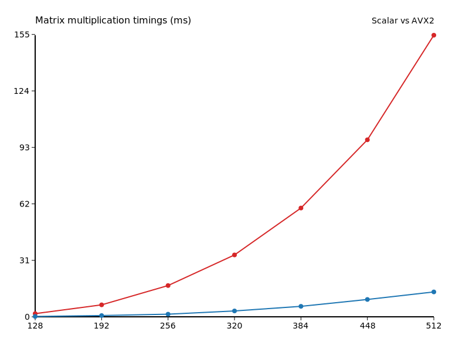

# Отчёт hw1_simd

Исследование проводилось на квадратных матрицах, значения времени указаны в миллисекундах.

| N  | Скалярно | AVX2 | Ускорение |
|----|----------|------|-----------|
| 128 | 1.742 | 0.192 | 9.06 |
| 192 | 6.566 | 0.684 | 9.60 |
| 256 | 17.160 | 1.435 | 11.96 |
| 320 | 33.964 | 3.216 | 10.56 |
| 384 | 59.710 | 5.747 | 10.39 |
| 448 | 97.171 | 9.519 | 10.21 |
| 512 | 154.589 | 13.656 | 11.32 |

Среднее ускорение составило 10.44 раз.

С увеличением размера матриц выигрыш AVX2 остаётся стабильным у порядка десятикратного.
