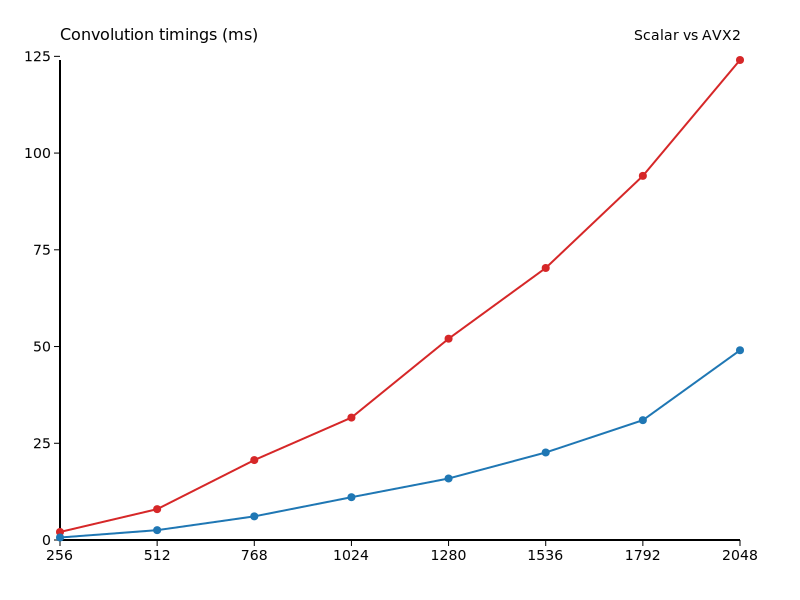

# Отчёт hw2_simd

Исследование проводилось на квадратных матрицах, значения времени указаны в миллисекундах.

| N    | Скалярно | AVX2  | Ускорение |
|------|----------|-------|-----------|
| 256  | 2.077 | 0.649 | 3.20 |
| 512  | 7.976 | 2.544 | 3.13 |
| 768  | 20.658 | 6.110 | 3.38 |
| 1024 | 31.637 | 11.062 | 2.86 |
| 1280 | 52.023 | 15.898 | 3.27 |
| 1536 | 70.301 | 22.620 | 3.11 |
| 1792 | 94.107 | 30.970 | 3.04 |
| 2048 | 124.054 | 49.038 | 2.53 |

Среднее ускорение составило 3.07 раза.

Начиная с матриц размером 512 и выше, AVX2 в среднем ускоряет вычисления примерно в три раза, с небольшим снижением эффекта на максимальном размере.
