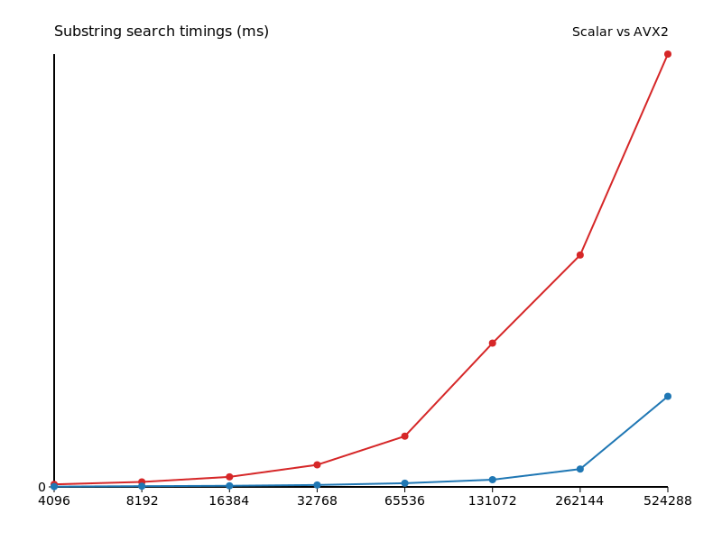

# Отчёт hw3_simd

Исследование проводилось на строках, значения времени указаны в миллисекундах.

| N | Скалярно | AVX2 | Ускорение |
|---|----------|------|-----------|
| 4096 | 0.001564 | 0.000199 | 7.86 |
| 8192 | 0.003068 | 0.000448 | 6.85 |
| 16384 | 0.006167 | 0.000686 | 8.99 |
| 32768 | 0.013571 | 0.001182 | 11.48 |
| 65536 | 0.031177 | 0.002278 | 13.69 |
| 131072 | 0.088382 | 0.004438 | 19.91 |
| 262144 | 0.142542 | 0.010972 | 12.99 |
| 524288 | 0.266054 | 0.055666 | 4.78 |

Среднее ускорение составило 10.82 раза.

Основной выигрыш достигается на строках средней длины, где проверка позиций сразу пакетами окупает накладные расходы.
