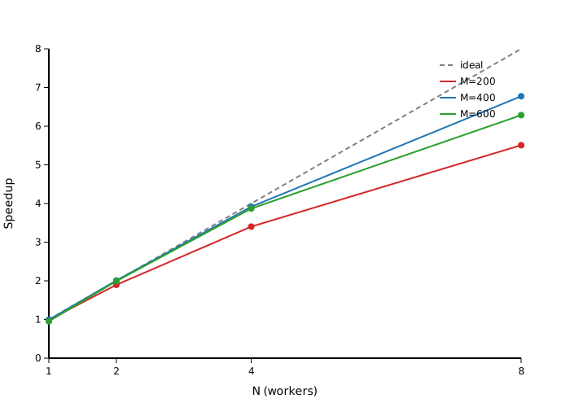

# Отчёт hw6_parallel_for

Исследование ускорения умножения матриц при параллелизации с помощью parallel_for (tasks.h).

| M | N | Ускорение |
|---|---|-----------|
| 200 | 1 | 0.99 |
| 200 | 2 | 1.90 |
| 200 | 4 | 3.40 |
| 200 | 8 | 5.51 |
| 400 | 1 | 0.99 |
| 400 | 2 | 2.01 |
| 400 | 4 | 3.92 |
| 400 | 8 | 6.77 |
| 600 | 1 | 0.95 |
| 600 | 2 | 1.99 |
| 600 | 4 | 3.87 |
| 600 | 8 | 6.29 |

На графике видно, что ускорение растёт с количеством потоков, но не достигает идеального линейного значения (пунктирная линия). Для матриц 400x400 наблюдается лучшее ускорение при 8 потоках (6.77x). Отклонение от идеала связано с накладными расходами на синхронизацию задач в очереди и конкуренцией за кэш памяти.
